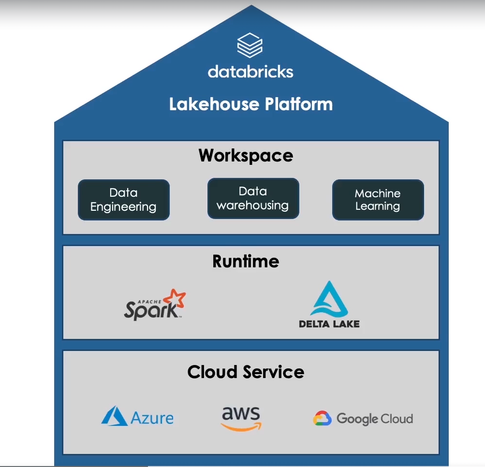

# Databricks - Data Engineer Associate

## What is Databricks?
It is a multi-cloud Lakehouse Platform based on Apache Spark

Architecutre of Databricks LakeHouse

Databricks generates resources in their account as well as in your cloud provider account.

In your account it deploys:
- A web UI
- Cluster Management
- Workflows
- Notebooks

In your cloud account it deploys:
- Cluster of VMs
- Storage (DBFS) - DataBricks File System

In summary, compute and storage will be in your own cloud account and DataBricks will provide the tools to use and control your infrastructure.

### More about DataBricks
Databricks was founded by the same engineers that created Apache Spark, that's why it supports the same languages that Spark, which are:

- Scala
- Python
- SQL
- R
- Java

It also supports:
- Batch Processing
- Stream Processing

Data could be:
- Structured
- Semi-Structured
- Unstructured (images & videos)

### DBFS
- It is a distributed file system
- Preinstalled in Databricks Cluster
- It is an abstraction layer, under the hood data is persisted to the underlaying cloud storage

## DataBricks Lakehouse Platform
### Delta Lake
- Delta lake is an open source storage framework that brings reliability to data lakes, since data lakes have many limitations like:
- data inconsistency
- performance issues

What is it?
- Open source tech
- Storage framework/layer
- Enabling building Lakehouse

What is NOT?
- Propietary tech
- Storage format/medium
- Data warehouse/Database service

- Is a component which is deployed in the cluster as part of the databricks runtime

- It gets stored as files in parquet format, it also stores transaction logs which act as the source of truth. 

### Transaction log (Delta log)
- Ordered records of every transaction
- Single source of truth
- Each commited transaction is stored as a JSON which contains:
- Operation performed (conditions and filter used)
- data files touched

### Write/Reads
There is a writer process and a reader process

The writer process:
1. Writes data
2. Adds transaction logs

The reader process
1. Read transaction log
2. Read data files

### Updates
Whenever you update the data, delta lake copys and updates the files needed into new files, and add this to the transaction log

When the reader process kicks in, it will now read the data from the new updated files, but the old files are kept as well for versioning purposes.

### What happens with simultaneous write/reads?
In this case the reader process will get the files needed from the transaction log while the writer process is still writing the new file. You will never encounter death locks, and once the writer process finishes it will add the new transaction log for the next read.

### What happends with Failed Writes?
It will simply not add any transaction logs so the new file that was corrupted/failed will never be read.

### Delta Lake Advantages
- Brings ACID transactions to object storage
- Handle scalable metadata
- Full audit trail of all changes
- Builds upon standard data formats: Parquet + JSON

