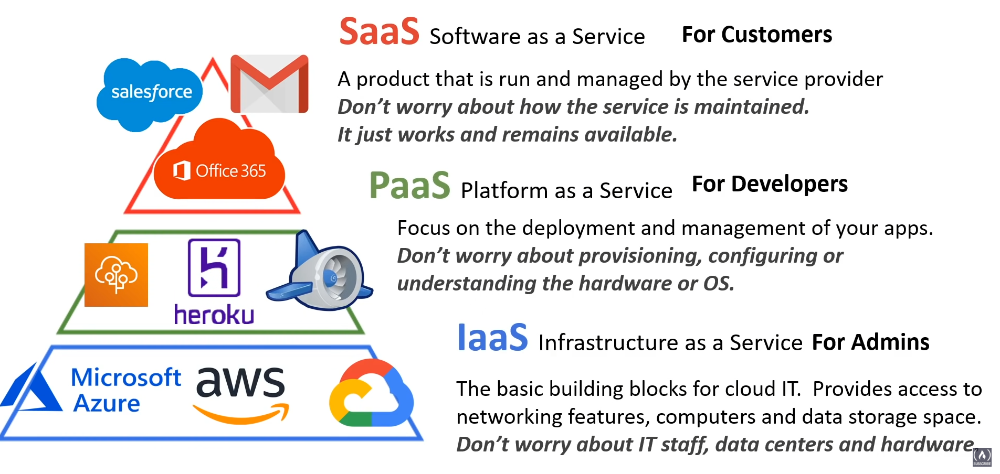
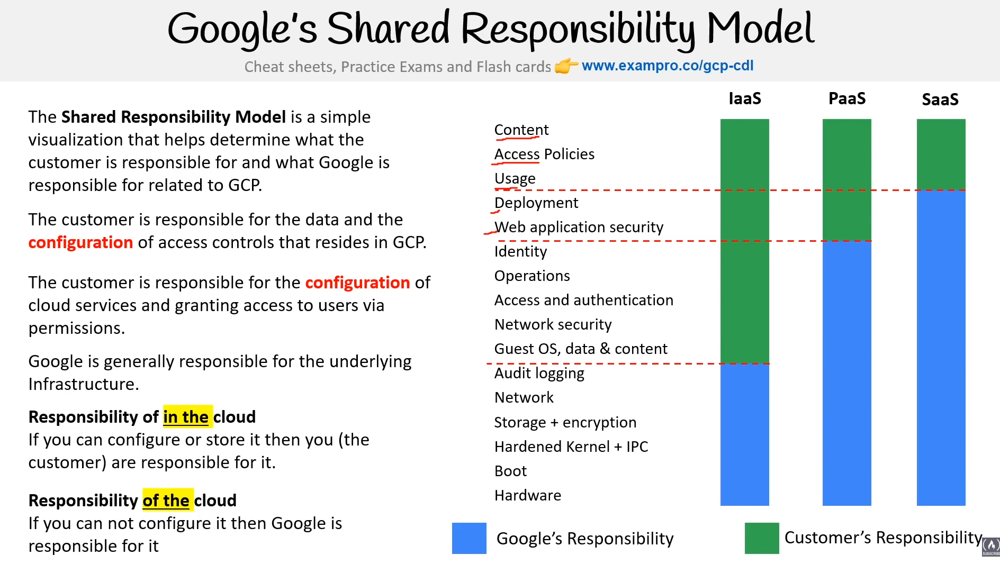
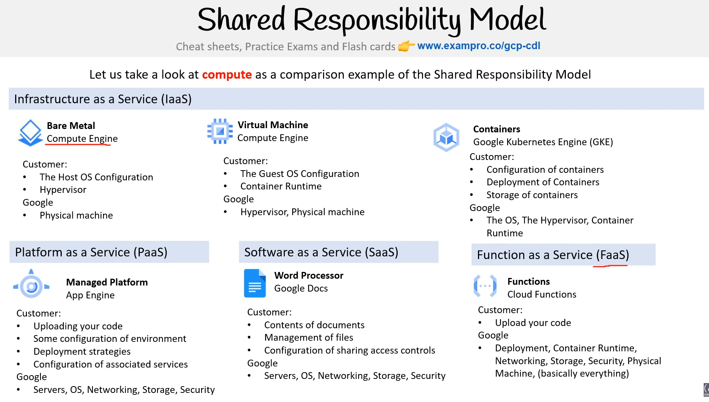
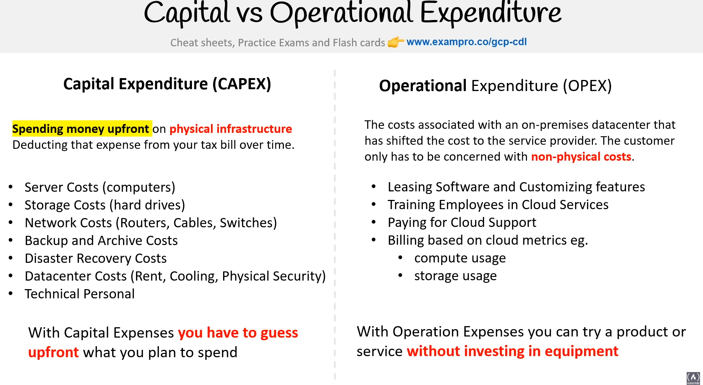
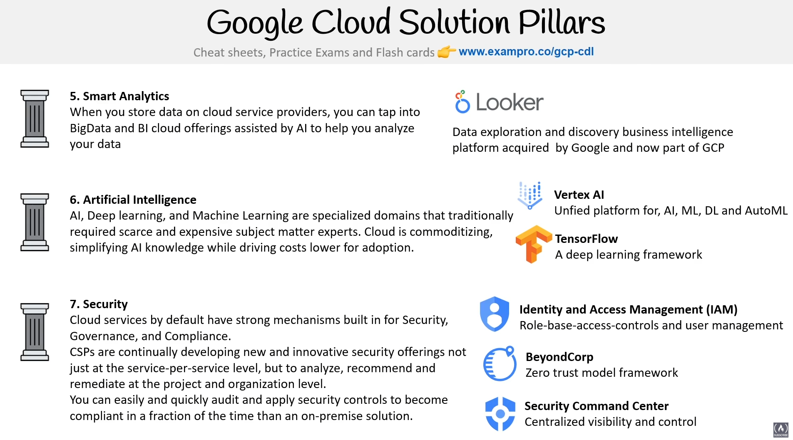

# Notes for Google Cloud Digital Leader Certification

### Cheatsheets
https://www.thecloudgirl.dev

## General Cloud theory
#### What is cloud computing?
The practice of using a network of remote servers hosted on the Internet to store, manage and process data.

#### Evolution of Cloud Hosting
1. Dedicated Servers
    - Very Expensive
    - High Maintenance
    - High Security
2. Virtual Private Server
    - Use virtual machines to isolate our applications
3. Shared Hosting
    - One physical machine shared by hundred of business.
    - Very cheap
    - Ver limited
4. Cloud hosting
    - Multiple Machines that acts as one system.
    - The system is abstracted into multiple services
    - It's flexible, scalable, secure, cost effective and highly configurable

### Benefits of Cloud Computing
1. Cost-effective (Pay for what you consume)
2. Launch anywhere in the world
3. Security - Cloud provider takes care of physical security.
4. Reliable - Data backups, disaster recovery, data replication, fault tolerance
5. Scalable - Increase or decrease resources on deman
6. Elastic - Automate scaling during spikes and drop in deman
7. Current - Underlying hardware and software is upgraded and replaced by provider without interruption

### Common Cloud Services
1. Compute
2. Storage
3. Networking
4. Databases

GCP has 60+ cloud services

### Types of Cloud Computing
1. SaaS - Software as a Service
2. PasS - Platform as a Service
3. IaaS - Infrastructure as a Service

### Google's Shared Responsibility Model
Simple visualization that determine what the customer is responsible forand what Google is responsible for related to GCP.

### Cloud Computing Deployment Models
1. Public Cloud (CLoud-Native)
2. Private Cloud (On-Premise)
3. Hybrid Cloud (Use both on premise and CLoud Service Provider)
4. Cross-Cloud (Multiple Cloud Providers e.g. AWS, Azure, GCP)

## Total Cost of Ownership
### CAPEX vs OPEX (Capital vs. Operational Expenditure)

### Cloud Architecture Terminologies
1. High Availability - Ability for your service to remain available by ensuring there is no **single point of failure**
2. Scalability - Increase your capacity based on the demand (vertical vs horizontal scaling)
3. Elasticity - Automatically increase or decrease your capacity (AUTOMATED) (Scaling Out - Add more services, Scaling In - REmoving more servers of the same size)
4. Fault Tolerance - Ensure there is not single point of failure, **prevent** the chance of failure. You create fail-over services/plan to shift traffic to a redundant system in case the primary system fails.
5. High Dureability/Disaster Recovery - Ability to recovery your data (Backups/how fast you can restore)

## Global Infrastructure
Region - Independent geographic areas that consists of zones (Usually 3 zones per region)

GCP has 25 Regions

### Edge Network
It is the practice of having compute and data storage as closes as possible to the end user

Points pf PResence (PoP) is an intermediate location between a GCP Region and the end user

Edge PoP - A location where a user can quickly enter (ingress) the GCP Network

CDN PoP - A location to serve (egress) cached website, files, assets to the end user

Cloud Media Edge - A location specialized for the delivery of media.

### Zones
Physical location made of one or more Data Centers which contains hundreds of thousands of computers

Datacenters within a region will be isolated from each other, but close enough to provide low-latency

### Resource Scoping
It refers to how much coverage a resource has

- Zonal resources
- Regional resources
- Multi-regional resource
- Global resource
- Internal Services (Foundational services used by other services, you don't interact with them directly and they are managed by Google e.g. Spanner, Colossus, Borg and Chubby)

### Data Residency
What is it? - Physical or geographic location of where an organization or cloud resources reside.

Compliance Boundaries - Regulatory compliance by a government or organization that describes where the data and resources are allowed to reside.

**Assured Workloads** - A feature that allows you to apply various security controls to an env.
- Data Residency
- Personnel data access controls based on attributes
- Encryption

### Cloud Interconnect
This is for hybrid services, it provides direct physical connections between your on-premises network and GCP

It enables you to transfer large amounts of data between networks.

It has two offerings:
1. Dedicated - A direct physical connection between on-premises and GCP through a co-location facility, speed is between 10-200 Gbps

2. Partner - A direct physical connection between the on-premises network and GCP through a trusted third-party, speed is between 50Mbps - 10 Gbps

### Google Cloud for Government
What is Public Sectors?
They are public goods and governmental services such as:
- military
- law enforcement
- infrastructure
- public transit
- public education
- health care
- the government itself

GCP can be utilized by public sector or organizations working for the public sector, GCP achieves this by meeting regulatory compliance programs

### Latency
Latency - Time delay between two physical systems

Lag - Noticeable delay between the actions of input and the reactions of the server sent back to the client

- Inter-Regional Latency (worst case: 500ms) Triple digits
- Inter-Zonal Latency (worst case: 10ms) Double digits

## Innovation Waves
Kondratiev Waves - are hypothesized cycle-like phenomena in the global world economy.

The phenomenon is closely connection with Tech life cycles e.g. Steam engine, railway steel, electrical engineering, petrochemicals, information technologies

Google suggests that we are in a Wave right now that includes cloud technology as one of the main factors

## Burning Platform
is a term used when a company abandons old tech for new tech with the uncertainty of success and ca be motivated by fear that the organization survival depends on its digital transformation

## Evolution of Computing Power
- General computig - Intel Xeon CPU Processor
- Tensor Computing - Tensor Processing Unit 3.0 (TPUs) 50x faster than traditional CPUs
- Quantum Computing (Google Quantum AI) - 100 Million times faster
    1. Google Foxtail
    2. Google Bristlecone
    3. Google Sycamore

## Digital Transformation
Adoption of digital tech to transform services or business through
1. Replacing non-digital or manual process
2. Replacing older digital tech with newer

Google's 7 Solutions Pillars (not asked in exam)
1. Infrastructure Modernization
2. Business Applications platform Portfolio
3. Application Modernization
4. Database and storage Solutions
5. Smart Analytics
6. Artificial Intelligence
7. Security

## Cloud Shell
A free online env with a command line and a online code editor for cloud development

## Projects and Folders
A project in GCP is a logical grouping of resources.
A cloud resource must belong to a project

A project is made up of:
- Settings
- Permissions
- Other medatada

A project can't access another project's resources unless you use shared VPC or VPC Netowork Peering

Each project has the following:
- A name
- An ID
- A project number

