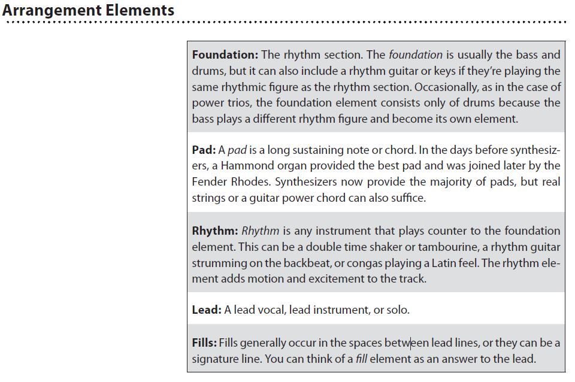
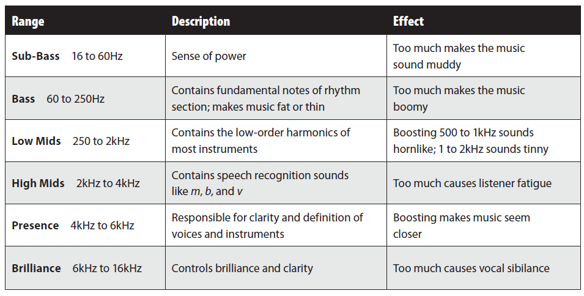
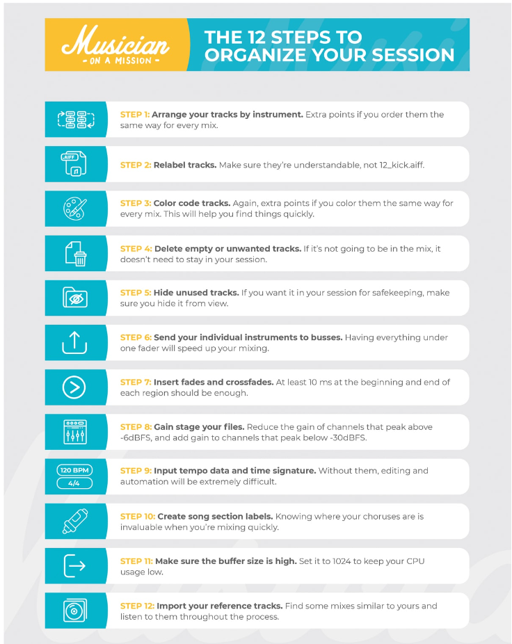
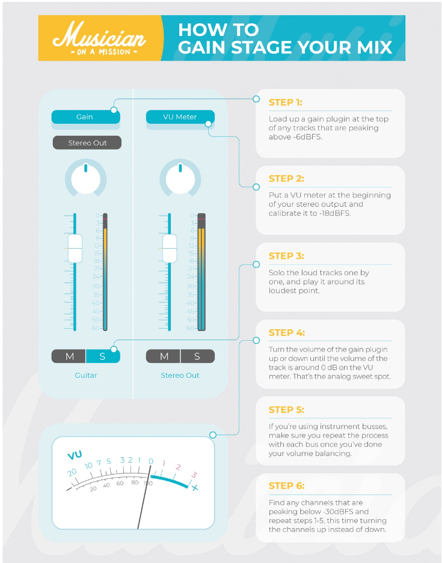
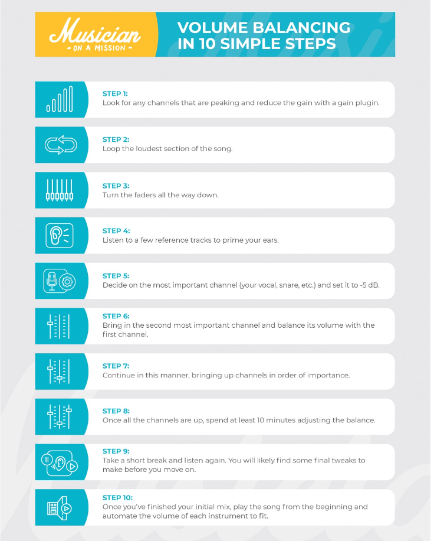
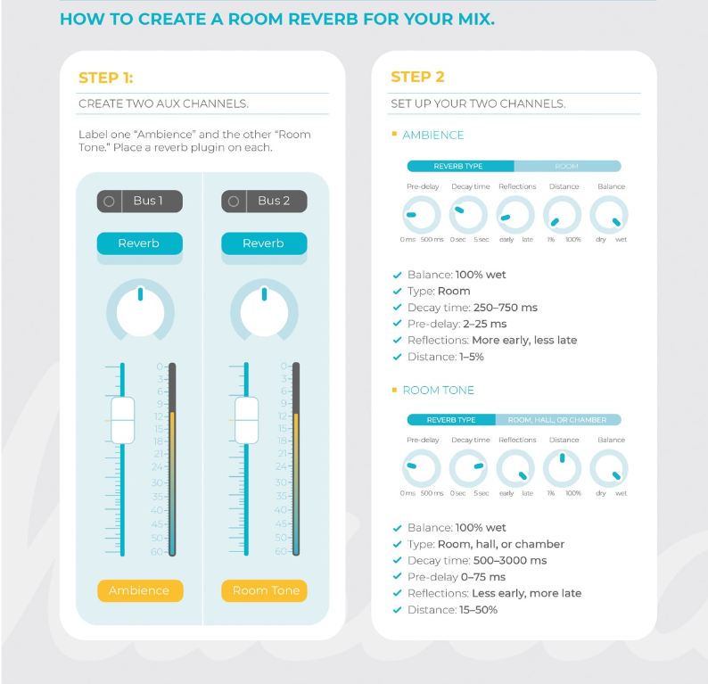
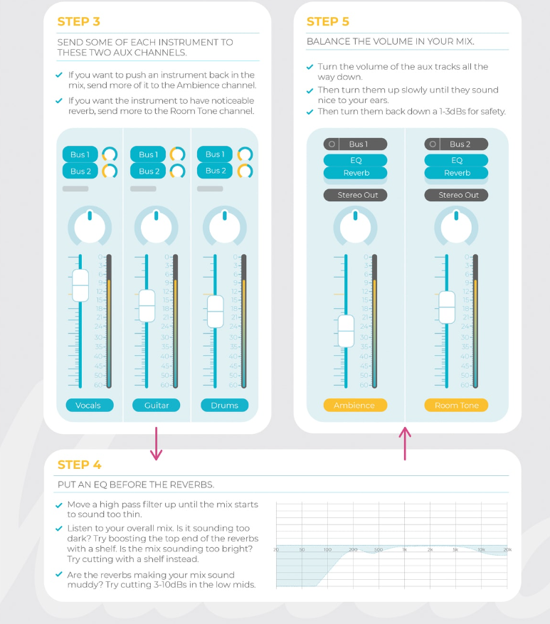
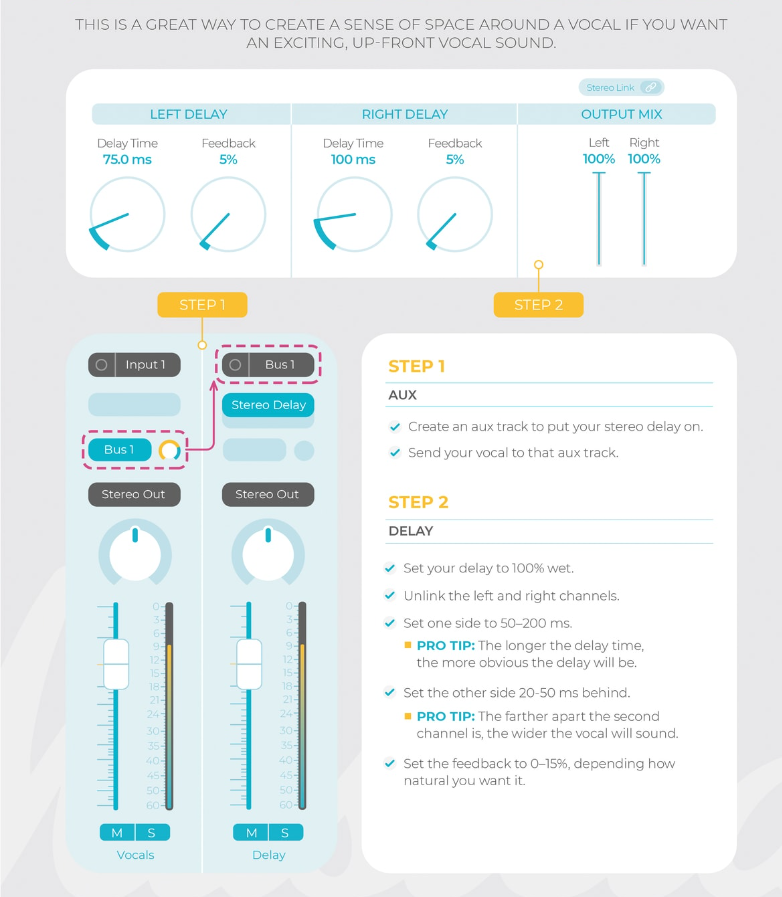

# Mixing
## Notes from "The Mixing Engineer handbook"

- Most great mixers think in three dimensions. They think “tall, deep,
and wide,” which means making sure all the frequencies are represented,
making sure there’s depth to the mix, and then giving it some stereo
dimension.

    - The **“tall”** dimension (which is called frequency range later in the book)
    is the result of knowing what sounds right as a result of having a reference
    point. Usually that means that all the sparkly, tinkly highs
    and fat, powerful lows are there. Sometimes it means cutting some mids.
    Clarity is what you aim for.

    - You achieve the effects or **“deep”** dimension by introducing new ambience elements into the mix. You usually do this with reverbs and delays.

    - The panning or “wide” dimension is placing a sound element in a soundfield in a way that makes a more interesting soundscape, such that you can hear each element more clearly.

### Signs of an Amateur Mix:
- **No contrast:** The same musical texture permeates the entire song.

- **A frequent lack of focal point:** The lyrics have holes where nothing is brought forward in the mix to hold the listener’s attention.

- **Mixes that are noisy:** You can hear clicks, hums, extraneous noises, countoffs, and sometimes lip-smacks and breaths.

- **Mixes that lack clarity and punch:** Instruments aren’t distinct. The low end is either too weak or too strong.

 - **Mixes that sound distant and are devoid of a feeling of intimacy:** The mix sounds distant because of too much reverb or overuse of other effects.

- **Inconsistent levels:** Instrument levels vary from balanced to soft or too loud. Certain lyrics can’t be distinguished.

- **Dull and uninteresting sounds:** Generic, dated, or often-heard sounds are used. There’s a difference between using something because it’s hip and new and using it because everyone else is using it.

### The Six Elements of a Mix
Every piece of modern music—meaning has six main elements to a great mix:
- **Balance:** The volume level relationship between musical elements
- **Panorama:** Placing a musical element in the soundfield.
- **Frequency range:** Having all frequencies properly represented
- **Dimension:** Adding ambience to a musical element
- **Dynamics:** Controlling the volume envelope of a track or instrument
- **Interest:** Making the mix special

### Element 1: Balance — The MixingPart of Mixing
- Good balance starts with good arrangement. It’s important to understand arrangement because so much of mixing is subtractive by nature. This means that the arrangement, and therefore the balance, is changed by the simple act of muting an instrument whose part doesn’t fit well with another.

- When two instruments that have essentially the same frequency band play at the same volume at the same time, the result is a fight for attention.

- Most well-conceived arrangements are limited in the number of elements that occur at the same time. An element can be a single instrument like a lead guitar or a vocal, or it can be a group of instruments like the bass and drums, a doubled guitar line, a group of backing vocals, and so on. Generally, a group of instruments playing the same rhythm is considered an element.

### Arrengement Elements

### Ways to Prevent Instrument Fighting
• Change the arrangement and re-record the track.

• Mute the off ending instruments so that they never play at the same
time.

• Lower the level of the off ending instrument.

• Tailor the EQ so that the off ending instrument takes up a diff erent
frequency space.

• Pan the off ending instrument to a diff erent location.

**Vocals/Lead/Kick first**

- Wherever you start from, mixers generally agree that the vocal, or whatever is the most prominent or significant melody instrument, has to make its entrance into the mix as soon as possible. The reason for this is
two-fold

    - First of all, the vocal is probably going to be the most important element, so it will take up more frequency space than other supporting instruments. If you wait until late in the mix to put the vocal in, there might not be enough space left, and the vocal will never sit right with the rest of the track.

    - The second reason has to do with effects. If you tailor all your effects to the rhythm section and supporting instruments, there might be none left when it’s time to add in the vocal or most prominent instrument.

### Element 2: Panorama—Placing the Sound in the Soundfield

tldr; For dance music, panning is not so important since most of your elements need to be in mono (bass, kick, snare, lead) so just pan 1:30, 10:30 some of the other elements like a shaker.

### Element 3: Frequency Range—Equalizing

- In the quest to make things sound bigger, fatter, brighter, and clearer, the equalizer is the chief tool that most mixers use. But perhaps more than
any other audio tool, the use of the equalizer requires a skill that separates the average engineer from the master.

**There are three primary goals when equalizing:**
- Make an instrument sound clearer and more defined.
- Make the instrument or mix bigger and larger than life.
- Make all the elements of a mix fit together better by juggling frequencies so that each instrument has its own predominate frequency range.

#### The Magic Frequencies

**Rule of Thumb**
- The fewer the instruments in the mix, the bigger each one should be.

- Conversely, the more instruments in the mix, the smaller each one needs to be for everything to fit together.

#### How to Equalize

**Logic:**

Equalize to make all the elements of a mix fit together better by juggling frequencies so that each instrument has its own predominate frequency range.
1. Start with the rhythm section (bass and drums). The bass should be clear and distinct when played against the drums, especially the kick
and snare. You should be able to hear each instrument distinctly. If not, do the
following:

    - Make sure that no two equalizers are boosting at the same frequency. If they are, move one to a slightly higher or lower frequency.

    - If an instrument is cut at a certain frequency, boost the frequency of the other instrument at that same frequency. For example, if the kick is cut at 500Hz, boost the bass at 500Hz.

2. Add the next most predominant element, usually the vocal, and proceed as above.

3. Add the rest of the elements into the mix one by one. As you add each instrument, check it against the previous elements as above.

**Easy-to-Remember Golden Rules of Equalization**
- If it sounds muddy, cut some at 250Hz.
- If it sounds honky, cut some at 500Hz.
- Cut if you’re trying to make things sound better.
- Boost if you’re trying to make things sound different.
- You can’t boost something that’s not there in the first place.

Pro Tip: Think of EQing as an effect. First do you standard EQing in your track and after that think of it as an effect to boost/cut certain frequencies in order to produce a better sound.

### Element 4: Dimension — Adding Effects

Just like panning places you either right or left, effects place the sound in front or in the back.

If the audio has effects it makes it like if it was sitting on the back while a dry signal sounds in front of you.

Pro-tip: Small reverbs or short delays make things sound bigger.

## Notes from other sources
------------------------

### How to EQ the Kick and Bass
Kick Drum Frequencies
- 30 – 80 Hz  – fundamental tone
- 300 – 600 Hz – boxiness (cut here)
- 4 – 8 kHz – Click
- Above 5 kHz – bleed from cymbals (cut here)

Bass Frequencies
- 30 – 100 Hz – thickness of synth sub-bass
- 50 – 150 Hz – thickness of bass guitar
- 150 – 400 Hz – muddy range of bass
- 800 – 2 kHz – clarity and presence for bass

source: https://www.sonarworks.com/blog/learn/eliminate-competition-between-the-kick-and-bass

------------------------
### The Top-Down Mixing Approach

Start mixing the most important elements and then down the hierarchy. Usually for house/techno is:

1. Kick -12db
2. Bass
3. Snare/clap
4. Lead synth/ Lead vocals

### Kick and Bass Bussing Technique

- Group the kick and the bass
- Add a drum buss to it (adjust parameters as you wish)
- Add a glue compressor with some makeup
- Add a utility and lower the gain until it is peaking at the same db that it was before adding the grouping effects

### Side-chain the reverb channel of your vocals to your dry signal

This is done in order to let the dry vocal duck the reverb and then let the reverb come back to live.

### Add a little bit of room reverb to all the tracks

Create an aux channel with a room reverb with short decay and send the kicks, the drums and pretty much every track to it.

source: https://www.youtube.com/watch?v=buBH3aPBQ5k&ab_channel=EDMTips

------------------------

## How to Mix
The steps are:
1.  Prep
2. Volume Balance
3. Compression
4. EQ
5. Space (Panning, Reverb, and Delay)
6. Volume Automation
7. Effects
8. Final Checks

### Step 1: Pre

Make sure to organize your session

Gain stage:

**Use a reference track:**

You never want to mix from memory. Your mixes will end up sounding pretty good in your own speakers but will fall apart anywhere else.

Comparing every aspect of your mix to a reference track – the low end, the mids, the snare volume, the vocal reverb, and so on – will increase the quality of your mixes tenfold.

### Step 2: Volume Balance

While working on your volume balance, I’d recommend listening to your monitors or headphones at a low level. That will keep your mix moves accurate.

The louder you listen to your mix, the better the mix sounds. That’s great in the moment.

### Step 3: Compression
Usually your vocals, kick and drums need to have compression since you want them to be your foundation. Compression helps to keep them in place.

### Step 4: EQ
Make sure to EQ any resonance specially in your vocals. You can EQ an individual track to get rid of resonance, room reverb, etc. Or you can use EQ for making a track blend into the mix. In the first case you need to EQ with the track soloed, in the second case you need to EQ with all the tracks playing.

### Step 5: Space (Panning, Reverb, and Delay)
**Panning**

Either pan your isntruments 50% to one side, or 100% to one side or right in the middle.

**Reverb**

Gives the ilussion of being in a "room" and creates the illusion that the instrument is farther away from the listener.

That means that instruments at the front of the stage should have only a little reverb. But instruments at the back of the stage should have a lot more.

**Delay**

Delay does a great job of creating a space around an instrument without pushing it too far back in the mix.

It’s especially great for vocals that you want to keep front and center.

### Step 6: Add Automation
Add automation to volume, frequency, etc for adding excitement to the song.

Make sure to pay attention at volume automation in case you need to make louder or quieter certain tracks at certain points in time.

### Step 7: Effects
Add effects to your tracks like heavy delays, distortion, chorus effect, etc.

Many people use delays as an effect. These delays are meant to be loud and obvious rather than the subtle delay you used for the vocals.

You’ll set them up in the same way as the vocal delay described above, but the delay time can be any length you want.

For a starting place, a quarter note delay often sounds cool as a vocal effect. And a dotted quarter note delay can sound very cool on an electric guitar.

### Step 8: Final Checks

A few tips for using your final check step effectively:

- **Give yourself at least a 12-hour break before starting.**
        
        Let your ears reacclimate to the sound of the world. You’ll hear more problems with your mix with a set of fresh ears.

- **Listen to the song from beginning to end and take notes.** 
        
        What would you change about this mix? That list is your guide to finishing this step up.

- **Don’t forget to use your reference tracks.** 

        Listen to them every fifteen minutes or so to re-acclimate your ears to the sound of a professional mix. You’ll find more problems in your own mix that way… which means you can fix those problems!
